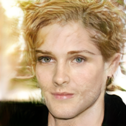

# PRO_GAN

## Description

This project contains an implementation of Progressive Growing of GANs (PRO_GAN). The code is organized in a Jupyter Notebook and uses PyTorch and torchvision.

## Usage

- The main code and inference logic are in the notebook: `Pro_GAN (1).ipynb`.
- Inference images are saved in the `logs/gan1` directory.
- Additional generated images are saved in the `PRO_GAN_images` directory.

## What is PRO_GAN?

**Progressive Growing of GANs (PRO_GANs)** is a technique introduced to improve the training of Generative Adversarial Networks (GANs) for high-resolution image synthesis. Instead of training the GAN on full-sized images from the start, PRO_GANs begin with low-resolution images and progressively increase the resolution as training advances. This approach leads to more stable training and higher quality results.

### Key Innovations

- **Progressive Training:** The generator and discriminator are trained to synthesize and discriminate images at increasing resolutions, starting from very low (e.g., 4x4) up to high resolutions (e.g., 1024x1024).
- **Equalised Learning Rate:**
  The weights are scaled at runtime to ensure equalized learning rate across all layers. The scaling is done as follows:
  
  
  
  where $W_i$ is the initial weight and $c$ is the He initialization constant, $c = \sqrt{2/(k^2 c)}$ (with $k$ as kernel size and $c$ as number of input channels). This is implemented in the `WSConv2d` class in the code.

- **Pixel Normalization:**
  Instead of Batch Normalization, Pixel Norm is used. The normalization for each pixel is computed as:
  
  
  
  where $\epsilon = 10^{-8}$, $N$ is the number of channels.
  
  This is implemented in the <code>PixelNorm</code> class in the code.

- **Fade-in (Smooth Transition):**
  To ensure a smooth transition when increasing image resolution, the output is interpolated between the previous and new layers:
  
  
  
  where $\alpha$ is gradually increased from 0 to 1 during the transition phase.

- **MiniBatch Training:**
  Training is performed in mini-batches to mitigate mode collapse and improve diversity in generated images.

### Reference

- **Paper:** [Progressive Growing of GANs for Improved Quality, Stability, and Variation](https://arxiv.org/abs/1710.10196)  
  Tero Karras, Timo Aila, Samuli Laine, Jaakko Lehtinen

### PRO GAN Architecture

- 
- 
- 

## Example Output

Below are some example images generated by the model:

  
  
  
  
  
  
  

## Requirements

- Python
- PyTorch
- torchvision
- tensorboard

